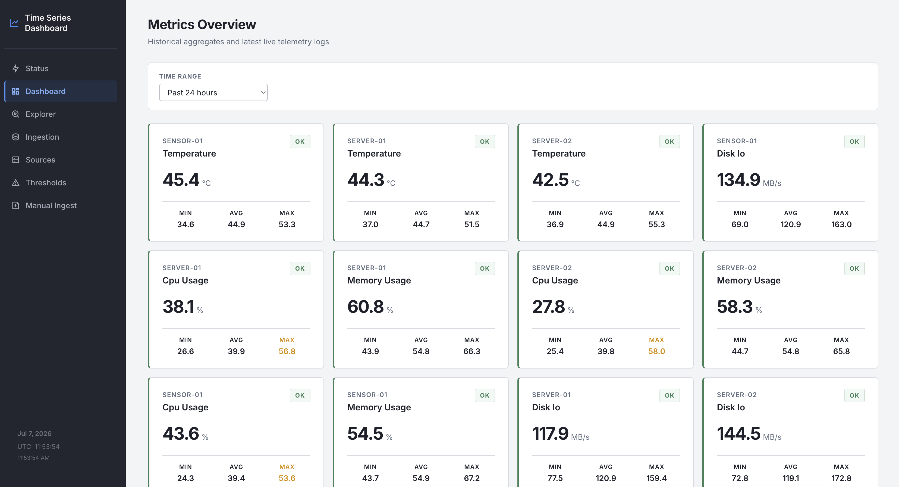
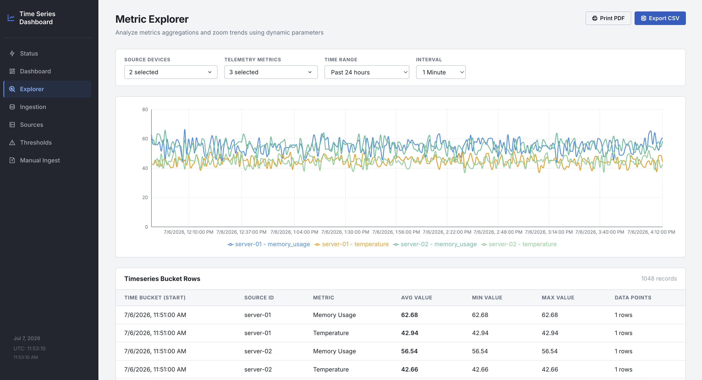
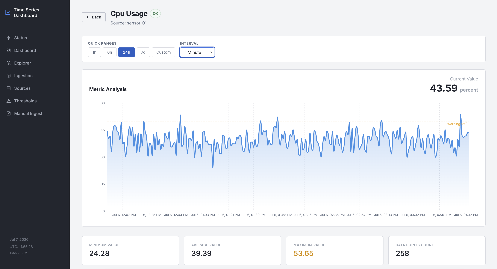
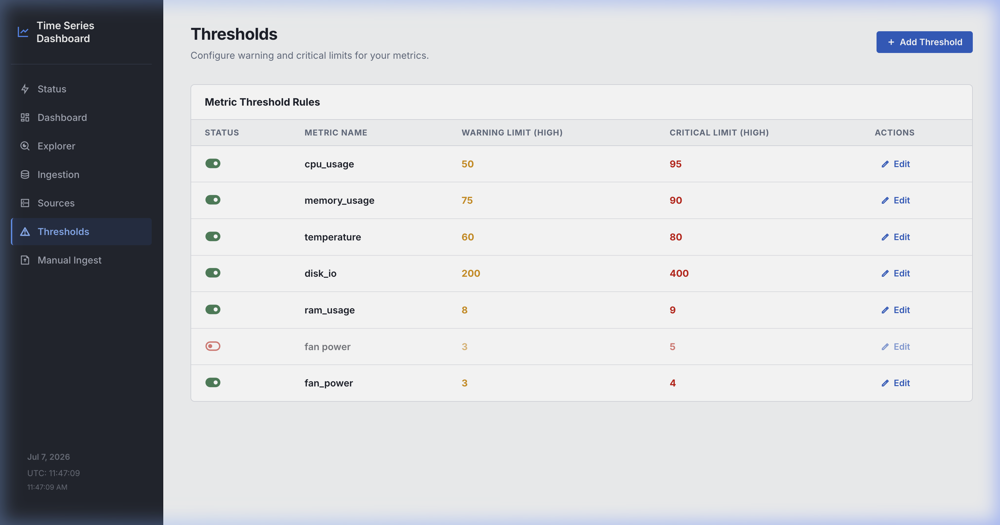
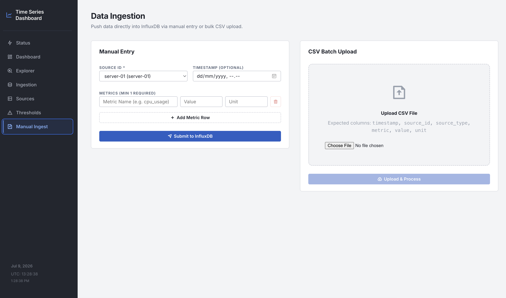
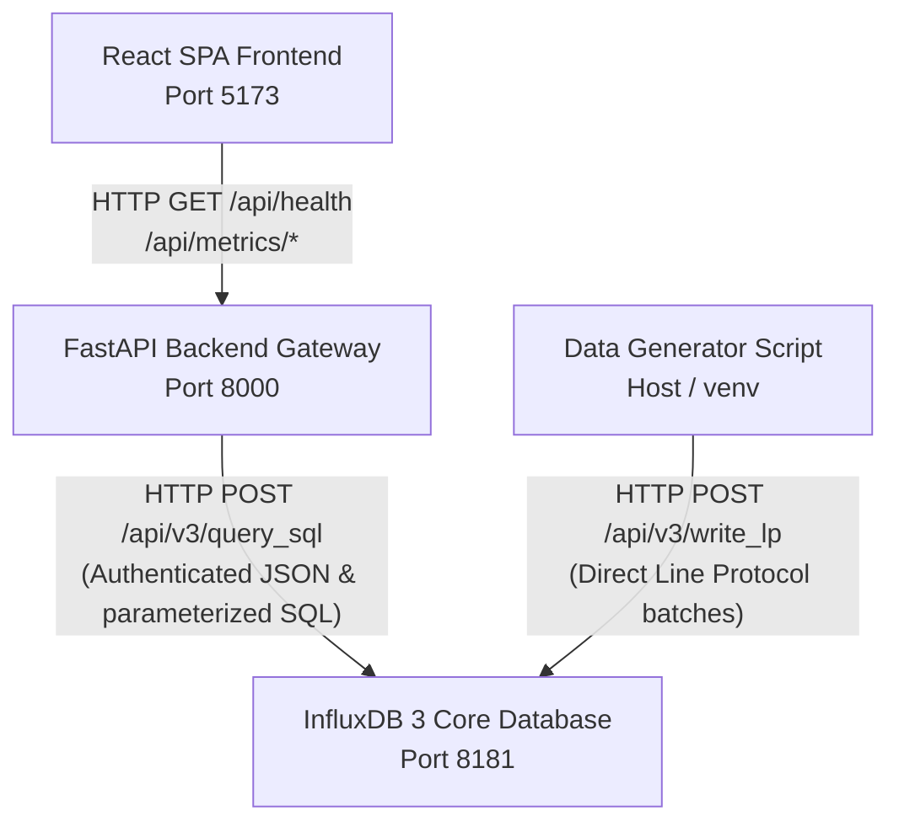
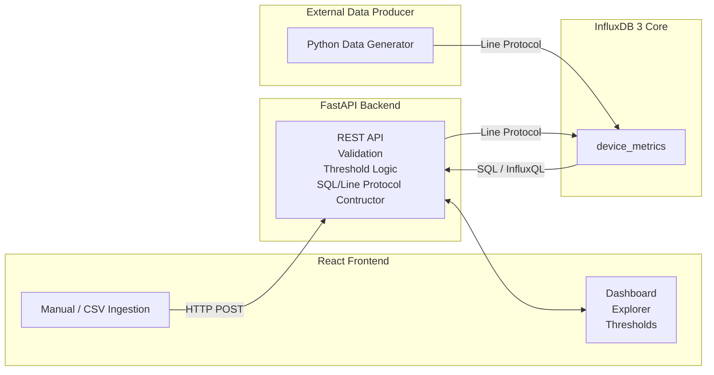

# InfluxDB Time-Series Monitoring Dashboard

A lightweight, high-performance working prototype of an InfluxDB Time-Series Monitoring Dashboard. The application features a React Single-Page Application (SPA) frontend built with Vite and Recharts, backed by a FastAPI service proxy, with InfluxDB 3 Core acting as the sole time-series database. The arsitektur decouples database credentials from the browser by routing all queries through the FastAPI backend gateway, which executes parameterized SQL queries on InfluxDB 3 Core (DataFusion) and compares metric readings against thresholds.

---

## Screenshots

<details>
<summary>Click to expand and view screenshots of the dashboard in action</summary>

### Dashboard Page


### Explorer Page


### Detail Page


### Thresholds Page


### Ingestion Page


</details>

---

## Architecture



---

## System Data Flow



This section explains the end-to-end relationship between each component in the stack — how data is produced, stored, queried, and finally visualized.

### 1. Data Producer (Ingestion)

Data enters the system from two sources:

- **Synthetic Data Generator** (`ingestion/generate_and_load.py`): A standalone Python script that runs on the host machine outside of Docker. It generates 48 hours of realistic time-series data for 3 device sources (`server-01`, `server-02`, `sensor-01`) across 4 metrics (`cpu_usage`, `memory_usage`, `temperature`, `disk_io`). Values are sampled from a Gaussian distribution around a baseline, with intentional spikes injected at hours 12, 24, and 36 to test threshold alerting.

- **Manual / Batch Ingest via UI**: The frontend's Ingest page allows operators to submit metric readings directly through form input (manual) or by uploading a compatible CSV file (batch). These requests go through the FastAPI backend, not directly to InfluxDB.

Both producers write data using **InfluxDB Line Protocol** — a compact text format that defines the schema implicitly through its structure (no `CREATE TABLE` required):

```
device_metrics,source_id=server-01,source_type=server,metric=cpu_usage value=85.42,unit="percent" 1720000000000000000
│              │                                        │                          │
│              └── Tags (indexed, used in WHERE/GROUP BY)
│                                                       └── Fields (actual data values)
│                                                                                  └── Timestamp (nanoseconds)
└── Measurement (table name)
```

### 2. Ingestion Process (Write Path)

- The **generator script** writes directly to InfluxDB via `POST /api/v3/write_lp`, bypassing the FastAPI backend for speed. It sends data in batches of 500 rows per HTTP request.
- The **UI ingest (manual/batch)** sends data to `POST /api/ingest/manual` or `/api/ingest/batch` on the FastAPI backend. The backend validates the payload, formats it as Line Protocol, and proxies the write to InfluxDB. It also writes a log entry to the separate `ingestion_log` table for operational tracking.

### 3. InfluxDB 3 Core (Storage)

InfluxDB 3 Core acts as the sole time-series database. It stores all records in columnar **Apache Parquet** files on disk and exposes two distinct query APIs:

- **`POST /api/v3/query_sql`**: Executes full **SQL** queries using the embedded Apache DataFusion engine. Used for all metric queries (summaries, timeseries, detail, aggregations). Supports parameterized queries to prevent injection.
- **`GET /query` (InfluxQL)**: Used for metadata catalog queries like `SHOW TAG VALUES` to retrieve the list of known `source_id` and `metric` values without scanning all Parquet files.

The schema is formed automatically from the Line Protocol tags and fields:
- **Tags** (`source_id`, `source_type`, `metric`) → Indexed string columns, efficient for `WHERE` and `GROUP BY`.
- **Fields** (`value` as Float, `unit` as String) → Unindexed data columns, queried by aggregation functions like `AVG`, `MIN`, `MAX`, and `selector_last`.

### 4. FastAPI Backend (Query Gateway)

The FastAPI backend serves as a **secure proxy and computation layer** between the frontend and the database. Its responsibilities:

- **Credentials isolation**: The `INFLUXDB_TOKEN` is never exposed to the browser. All database authentication happens server-side.
- **Parameterized SQL**: All user-controlled filter values (source IDs, metrics, time ranges) are passed as `$param` variables to the InfluxDB query engine, not interpolated as raw strings.
- **Status computation**: After fetching raw metric values from InfluxDB, the backend's `compute_status()` function compares each value against the configured threshold rules (stored in `config/thresholds.json` in memory) and appends a `status` field (`"ok"`, `"warning"`, or `"critical"`) to every row before sending the response.
- **Configuration state**: Threshold rules and source metadata are loaded from local JSON files at startup into `app.state`, making lookups in-memory fast without additional DB round-trips.

### 5. Frontend Dashboard (Read Path)

The React SPA (Single-Page Application) fetches all data from the FastAPI backend using standard HTTP GET/POST requests. It never talks to InfluxDB directly.

| Page | API Endpoints Used | What It Shows |
|---|---|---|
| **Dashboard** | `/api/metrics/summary`, `/api/metrics/timeseries`, `/api/metrics/latest` | Metric cards with current value, unit, color-coded status, and a trend chart |
| **Explorer** | `/api/metrics/timeseries`, `/api/thresholds`, `/api/metrics/list` | Filterable data table with threshold color coding and CSV export |
| **Detail** | `/api/metrics/detail`, `/api/thresholds` | Per-metric chart with reference lines at warning/critical levels |
| **Thresholds** | `/api/thresholds` (GET/POST/PUT) | CRUD management for threshold rules |
| **Ingest** | `/api/ingest/manual`, `/api/ingest/batch` | Manual and CSV-based data ingestion forms |

Color coding logic is applied client-side on the Explorer and Detail pages using threshold values fetched from `/api/thresholds`. On the Dashboard page, color coding is determined by the `status` field computed on the backend. In both cases, a threshold with `active: false` will always produce `"ok"` status — no color highlighting.

---


To run this project locally, ensure you have the following installed:
* **Docker & Docker Compose** (for running the backend and database services)
* **Python 3.12+** (for running the synthetic data generator utility)
* **Node.js 20+** (if you wish to run the frontend outside of Docker)

---

## Setup

Follow these steps to set up and run the entire stack from a clean clone:

### 1. Install InfluxDB 3 Core
Ensure you have InfluxDB 3 Core installed and running. You can follow the official installation instructions here:
[https://docs.influxdata.com/influxdb3/core/install/](https://docs.influxdata.com/influxdb3/core/install/)

### 2. Configure Environment Variables
Copy the template `.env.example` file to `.env`:
```bash
cp .env.example .env
```
Open `.env` and configure the database details. For local development with Docker Compose, you can use:
* `INFLUXDB_URL=http://localhost:8181` (used by the host-level data generator)
* `INFLUXDB_TOKEN=your_generated_admin_token` (see Step 3 below)
* `INFLUXDB_DATABASE=monitoring`
* `VITE_API_BASE_URL=http://localhost:8000`

### 2. Start the Infrastructure Services
Start the backend API and frontend containers:
```bash
docker compose up -d --build
```

### 3. Generate InfluxDB Admin Token
If this is the first time you are starting InfluxDB, generate an administrator token inside the 
*(If you are connecting to an existing pre-running InfluxDB container named `influxdb3-core`, use: `docker exec -it influxdb3-core influxdb3 create token --admin`)*

Copy the generated token string, paste it as the value for `INFLUXDB_TOKEN` in your `.env` file, and restart the backend container to apply the credentials:
```bash
docker compose up -d --build
```

---

## Generator Usage

Once the containers are running and the database is configured, seed the database with historical telemetry log data:

### 1. Initialize Virtual Environment
Navigate to the `ingestion/` directory, create a virtual environment, and install dependencies:
```bash
cd ingestion
python3 -m venv .venv
source .venv/bin/activate
pip install -r requirements.txt
```

### 2. Run Data Seeding
Run the python generator to insert 48 hours of time-series records:
```bash
python generate_and_load.py
```
This script automatically generates natural Gaussian variations for CPU, Memory, Suhu, and Disk I/O across 3 distinct device sources, introducing intentional threshold-breaching spikes on hours 12, 24, and 36 for system alert testing.

or
```
ingestion/.venv/bin/python -u ingestion/generate_and_load.py
```
---

## InfluxDB Data Structure & Schema Design

This project utilizes InfluxDB 3 Core, which uses an underlying Apache Parquet columnar storage engine.

### Database Configuration
- **Organization :** None (InfluxDB 3 doens't use organization)
- **Database (Bucket equivalent):** `monitoring`
- **Retention Settings:** Infinite (Default behavior, data is persisted indefinitely unless explicitly configured during database creation or via data lifecycle rules).

### Schema Definition
In InfluxDB, the schema is built dynamically (schema-on-write) via the Line Protocol. The primary table is defined as follows:
- **Measurement Name:** `device_metrics`
- **Tags (Indexed metadata):** `source_id`, `source_type`, `metric`
- **Fields (Unindexed data):** `value` (float), `unit` (string)
- **Timestamp:** Unix timestamp in Nanoseconds (`ns`)

### Tags vs Fields & Cardinality Justification
- **Tags (`source_id`, `source_type`, `metric`)**: These are defined as tags because they represent categorical metadata used to group, filter, and identify the source of the data. Tags are automatically indexed by InfluxDB, making `WHERE` and `GROUP BY` queries highly performant.
  - **Cardinality Consideration:** The cardinality (number of unique tag combinations) is a critical factor for database performance. In this schema, cardinality remains extremely low and predictable. With 3 `source_id`s, 2 `source_type`s, and 4 `metric`s, the maximum possible cardinality is 24. This is highly efficient and prevents memory exhaustion issues that plague high-cardinality schemas.
- **Fields (`value`, `unit`)**: These are defined as fields because they contain the actual measurement payload. `value` is a highly variable continuous float. `unit` is also treated as a field so it remains tightly coupled to the data value without bloating the tag index.

### Sample Data Mapping
Based on the provided raw metric records:
| metric | source_id | source_type | time | unit | value |
|---|---|---|---|---|---|
| disk_io | sensor-01 | sensor | 2026-07-05T07:49:00 | MB/s | 117.61 |
| memory_usage | sensor-01 | sensor | 2026-07-05T07:49:00 | percent | 53.47 |
| temperature | sensor-01 | sensor | 2026-07-05T07:49:00 | celsius | 44.43 |
| cpu_usage | server-01 | server | 2026-07-05T07:49:00 | percent | 42.87 |

### Sample Line Protocol Records
When this data is constructed into InfluxDB Line Protocol for ingestion, it looks like this (with the ISO timestamps converted to nanosecond Unix epochs):
```text
device_metrics,source_id=sensor-01,source_type=sensor,metric=disk_io value=117.61,unit="MB/s" 1783237740000000000
device_metrics,source_id=sensor-01,source_type=sensor,metric=memory_usage value=53.47,unit="percent" 1783237740000000000
device_metrics,source_id=sensor-01,source_type=sensor,metric=temperature value=44.43,unit="celsius" 1783237740000000000
device_metrics,source_id=server-01,source_type=server,metric=cpu_usage value=42.87,unit="percent" 1783237740000000000
```

---

## URLs

* **Frontend Dashboard Interface:** [http://localhost:5173](http://localhost:5173)
* **Backend API Documentation (Swagger UI):** [http://localhost:8000/docs](http://localhost:8000/docs)
* **Backend Health Check Endpoint:** [http://localhost:8000/api/health](http://localhost:8000/api/health)
* **Influxdata built-in UI** [http://localhost:8889/databases](http://localhost:8889/databases)