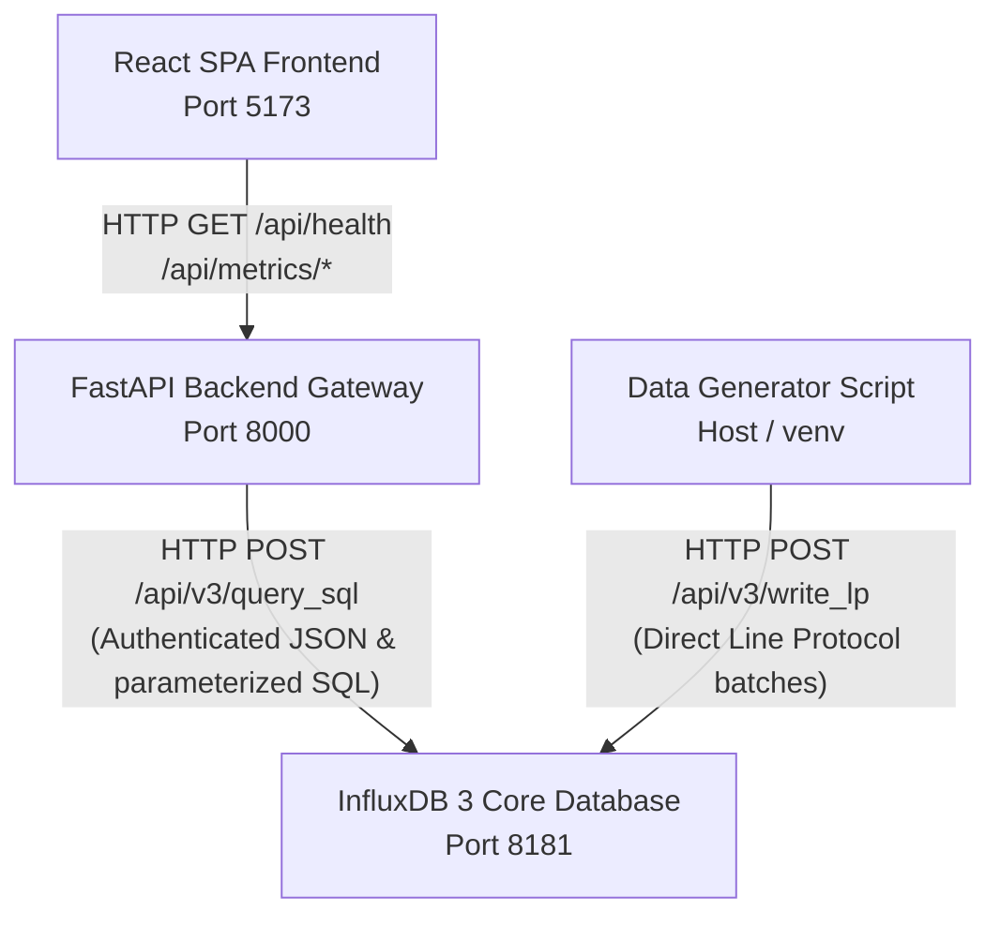

# InfluxDB Time-Series Monitoring Dashboard

A lightweight, high-performance working prototype of an InfluxDB Time-Series Monitoring Dashboard. The application features a React Single-Page Application (SPA) frontend built with Vite and Recharts, backed by a FastAPI service proxy, with InfluxDB 3 Core acting as the sole time-series database. The arsitektur decouples database credentials from the browser by routing all queries through the FastAPI backend gateway, which executes parameterized SQL queries on InfluxDB 3 Core (DataFusion) and compares metric readings against thresholds.

---

## Architecture



---

## Prerequisites

To run this project locally, ensure you have the following installed:
* **Docker & Docker Compose** (for running the backend and database services)
* **Python 3.12+** (for running the synthetic data generator utility)
* **Node.js 20+** (if you wish to run the frontend outside of Docker)

---

## Setup

Follow these steps to set up and run the entire stack from a clean clone:

### 1. Configure Environment Variables
Copy the template `.env.example` file to `.env`:
```bash
cp .env.example .env
```
Open `.env` and configure the database details. For local development with Docker Compose, you can use:
* `INFLUXDB_URL=http://localhost:8181` (used by the host-level data generator)
* `INFLUXDB_TOKEN=your_generated_admin_token` (see Step 3 below)
* `INFLUXDB_DATABASE=monitoring`
* `VITE_API_BASE_URL=http://localhost:8000`

### 2. Start the Infrastructure Services
Start the backend API and InfluxDB database containers:
```bash
docker compose up backend --build -d
```
*Note: If you want to run the full stack including the frontend via Docker, you can run:*
```bash
docker compose up -d --build
```

### 3. Generate InfluxDB Admin Token
If this is the first time you are starting InfluxDB, generate an administrator token inside the database container:
```bash
docker exec -it time-series-dashboard-influxdb-1 influxdb3 create token --admin
```
*(If you are connecting to an existing pre-running InfluxDB container named `influxdb3-core`, use: `docker exec -it influxdb3-core influxdb3 create token --admin`)*

Copy the generated token string, paste it as the value for `INFLUXDB_TOKEN` in your `.env` file, and restart the backend container to apply the credentials:
```bash
docker compose restart backend
```

---

## Generator Usage

Once the containers are running and the database is configured, seed the database with historical telemetry log data:

### 1. Initialize Virtual Environment
Navigate to the `ingestion/` directory, create a virtual environment, and install dependencies:
```bash
cd ingestion
python3 -m venv .venv
source .venv/bin/activate
pip install -r requirements.txt
```

### 2. Run Data Seeding
Run the python generator to insert 48 hours of time-series records:
```bash
python generate_and_load.py
```
This script automatically generates natural Gaussian variations for CPU, Memory, Suhu, and Disk I/O across 3 distinct device sources, introducing intentional threshold-breaching spikes on hours 12, 24, and 36 for system alert testing.

or
```
ingestion/.venv/bin/python -u ingestion/generate_and_load.py
```
---

## URLs

* **Frontend Dashboard Interface:** [http://localhost:5173](http://localhost:5173)
* **Backend API Documentation (Swagger UI):** [http://localhost:8000/docs](http://localhost:8000/docs)
* **Backend Health Check Endpoint:** [http://localhost:8000/api/health](http://localhost:8000/api/health)
